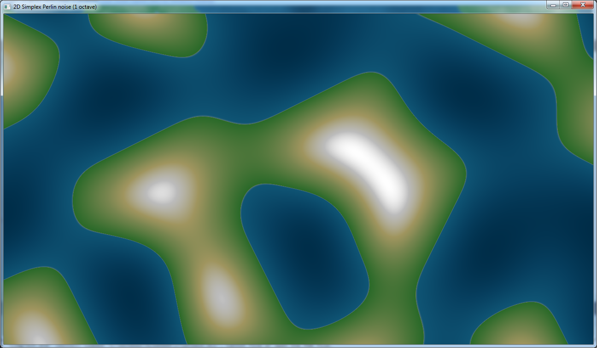
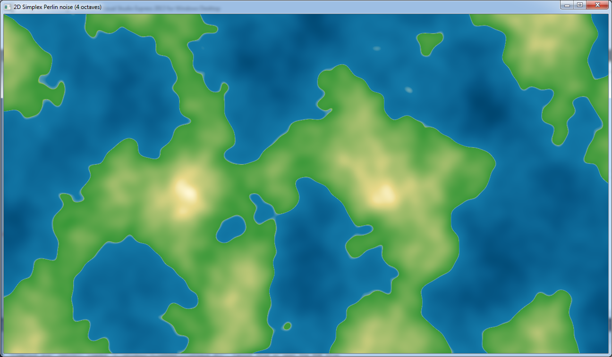

SimplexNoiseCImg
----------------

A simple 2D Map Generator using my SimplexNoise and CImg

Copyright (c) 2013-2018 Sébastien Rombauts (sebastien.rombauts@gmail.com)

2D image with only 1 octave of 2D Simplex Noise:


2D image with 4 octaves of 2D Simplex Noise:


2D image with 7 octaves of 2D Simplex Noise:


## Building & testing with CMake

### Get Google Test submodule

```bash
git submodule init
git submodule update
```

### Typical generic build (see also "build.bat" or "./build.sh")

```bash
mkdir build
cd build
cmake ..        # cmake .. -G "Visual Studio 15 2017"
cmake --build . # make
ctest .         # make test
```

### Debug build for Unix Makefiles

```bash
mkdir Debug
cd Debug
cmake .. -DCMAKE_BUILD_TYPE=Debug   # -G "Unix Makefiles"
cmake --build . # make
ctest .         # make test
```
